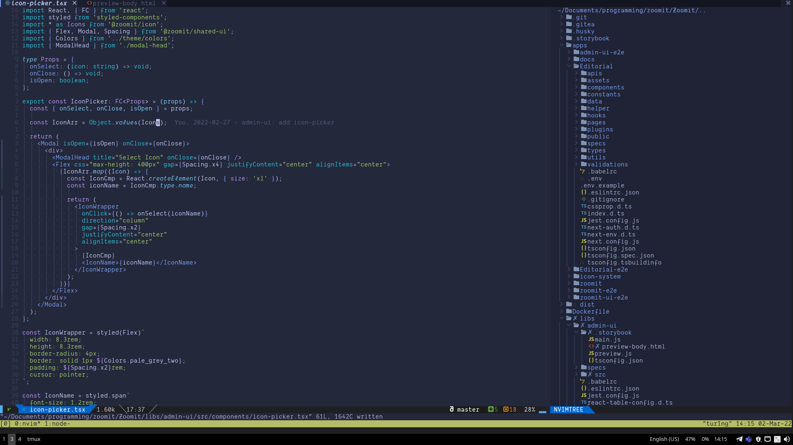

- OS: [Manjaro](https://manjaro.org/)
- WM: [i3](https://github.com/Airblader/i3)
- Editor: neovim
- Shell: zsh
- Terminal: Alacritty
- Terminal Multiplexer: tmux

<pre>
  <code>
██████████████████  ████████   tur1ng@tur1ng
██████████████████  ████████   -------------
██████████████████  ████████   OS: Manjaro Linux x86_64
██████████████████  ████████   Host: MS-7C37 2.0
████████            ████████   Kernel: 5.13.19-2-MANJARO
████████  ████████  ████████   Uptime: 20 mins
████████  ████████  ████████   Packages: 1065 (pacman)
████████  ████████  ████████   Shell: zsh 5.8
████████  ████████  ████████   Resolution: 1920x1080
████████  ████████  ████████   WM: i3
████████  ████████  ████████   Theme: Adapta-Nokto-Eta-Maia [GTK2/3]
████████  ████████  ████████   Icons: Papirus-Adapta-Nokto-Maia [GTK2/3]
████████  ████████  ████████   Terminal: tmux
████████  ████████  ████████   CPU: AMD Ryzen 7 3800X (16) @ 3.900GHz
                               GPU: NVIDIA GeForce RTX 2070 SUPER
                               Memory: 3220MiB / 15950MiB
  </code>
</pre>

## Neovim

