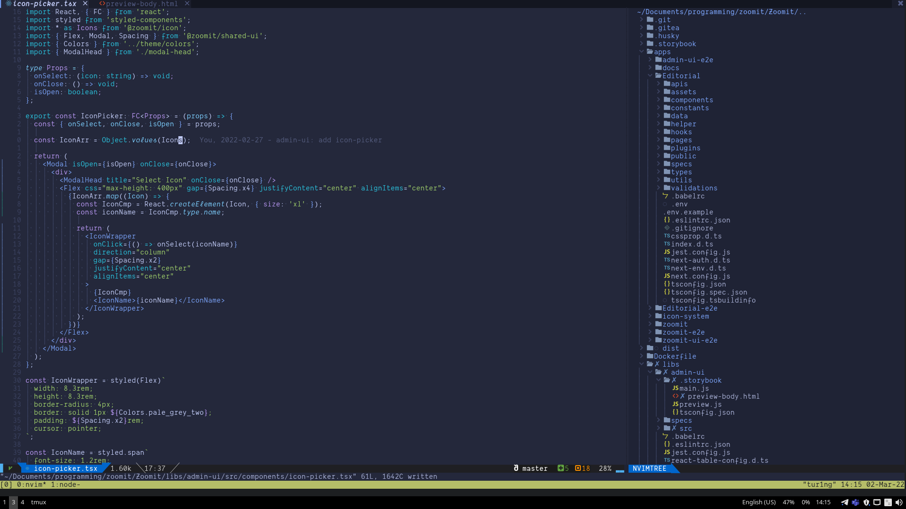

## Workspace
- Distribution: [Arch](https://archlinux.org/)
- Compositor: [Hyprland](https://hypr.land/)
- Editor: [Zed](https://zed.dev/), [Neovim](https://neovim.io/)
- Shell: [fish](https://fishshell.com/)
- Terminal: [Ghostty](https://ghostty.org/)
- Terminal Multiplexer: [Zellij](https://zellij.dev/)

## Arch

[archinstall](https://github.com/archlinux/archinstall) is now included by default. I highly recommend installing arch using it. It took me 4 minutes and 51 seconds to install arch. 

I used Manjaro for many year. I was surprised to learn that `man`, `less` and many other binaries are not installed by default :)))

## Hyprland
I used i3 for the past five years. There is nothing wrong with i3 until you try Hyprland. Hyprland is very well thought out. It's fast and configuration is intuitive.

Immediately after installing it, You'll be thrown into a blank canvas with only your mouse working (if you are lucky). I instantly felt like I was home.

One thing that was unexpected for me was [hyprland's wiki](https://wiki.hypr.land/). It's very beginner friendly. It seems like every problem that new users had was documented.

- [Vicinae](https://www.vicinae.com/)
- [Waybar](https://github.com/alexays/waybar)
- cliphist
- hyprpaper
- [Yazi](https://yazi-rs.github.io/)
- dunst

## Ghostty
gpu goes brrr

## fish
zsh + 50 plugins built in

## Neovim

- [lazy.nvim](https://github.com/folke/lazy.nvim): plugin manager
- theming:
  - [devicons](https://github.com/ryanoasis/vim-devicons): file type icons to Vim plugins
  - [tokyonight](https://github.com/folke/tokyonight.nvim): dark Neovim theme with support for lsp, treesitter
- [nvim-tree.lua](https://github.com/kyazdani42/nvim-tree.lua): file explorer tree
- [bufferline](https://github.com/akinsho/bufferline.nvim): buffer tab view
- [telescope](https://github.com/nvim-telescope/telescope.nvim): fuzzy finder
- [indent-blankline](https://github.com/lukas-reineke/indent-blankline.nvim): buffer parser for better syntax highlighting
- [mason](https://github.com/mason-org/mason.nvim): install and manage LSP servers
- [nvim-treesitter](https://github.com/nvim-treesitter/nvim-treesitter):

## Zellij

## Command-line programs

- docker
- kubectl
- helm
- argocd
- minikube
- curl
- grpcurl
- grpcui
- scp
- ffmpeg
- Rclone
- UxPlay
- Ventoy
- bat
- frp
- tcpdump

## Applications

- Zen
- pwvucontrol
- chromium
- VLC
- Cisco Secure Client
- JetBrains Toolbox
- Lens
- OBS Studio
- Telegram
- TeamSpeak
- Wireshark

## Development

Languages and Toolchains:

- C/C++
  - Make
  - CMake
  - vcpkg
- Python
  - pip
  - uv
- Rust
  - cargo
  - rustup
  - just
- Go
- Lua
- JavaScript/TypeScript
  - fnm
  - Node.js
  - npm
  - pnpm
- Java
  - Gradle
- C#
  - .NET
  - NuGet
